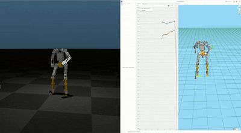

# RoboLab - E1 Bipedal Robot Reinforcement Learning Framework

## Community Group


A training and deployment framework for the DroidRobot E1 biped, built on [Isaac Lab](https://github.com/isaac-sim/IsaacLab) and [RSL-RL](https://github.com/leggedrobotics/rsl_rl). It supports multiple learning paradigms (direct RL, AMP, motion imitation) and MuJoCo Sim2Sim transfer.

---

## Table of Contents

- [Demo](#demo)
- [Project Structure](#project-structure)
- [Environment Setup](#environment-setup)
- [Workflow](#workflow)
- [Training](#training)
- [Policy Playback](#policy-playback)
- [Sim2Sim Deployment](#sim2sim-deployment)
- [Foxglove Visualization](#foxglove-visualization)
- [Motion Retargeting Tools](#motion-retargeting-tools)
- [Available Tasks](#available-tasks)
- [Robot Specs](#robot-specs)
- [References and Thanks](#references-and-thanks)
- [License](#license)

---

## Demo

| AMP | BeyondMimic |
|---|---|
|  |  |

---

## Project Structure

```text
E1_Whole_Lab/
├── robolab/                         # Main package
│   ├── assets/robots/               # Robot asset config (droidrobot.py)
│   ├── tasks/
│   │   ├── direct/                  # Direct RL tasks
│   │   │   ├── base/                #   E1-Flat / E1-Rough
│   │   │   ├── attn_enc/            #   E1-AttnEnc
│   │   │   └── interrupt/           #   E1-Interrupt
│   │   └── manager_based/           # Manager-based tasks
│   │       ├── amp/                 #   E1-AMP
│   │       └── beyondmimic/         #   E1-BeyondMimic
│   └── utils/keyboard.py            # Isaac Lab keyboard control
├── scripts/
│   ├── rsl_rl/                      # Isaac Lab training and playback
│   │   ├── train.py                 #   Training entry
│   │   ├── play.py                  #   Direct RL / AttnEnc / Interrupt playback
│   │   ├── play_amp.py              #   AMP playback
│   │   ├── play_bm.py               #   BeyondMimic playback
│   │   └── cli_args.py              #   Shared CLI args
│   ├── mujoco/                      # Sim2Sim deployment
│   │   ├── sim2sim_e1.py            #   Direct RL policy
│   │   ├── sim2sim_e1_amp.py        #   AMP policy
│   │   ├── sim2sim_e1_bm.py         #   BeyondMimic policy
│   │   ├── sim2sim_e1_attn_enc.py   #   AttnEnc policy
│   │   ├── sim2sim_e1_interrupt.py  #   Interrupt policy
│   │   ├── keyboard.py              #   Numpad-style keyboard control
│   │   └── foxshow_data/            #   Foxglove recordings (.mcap)
│   └── tools/
│       ├── foxshow.py               #   Foxglove backend
│       ├── list_envs.py             #   List all registered environments
│       ├── fix_pkl_numpy.py         #   Fix numpy compatibility for motion pkl files
│       └── retarget/                #   GMR -> Lab motion retargeting
│           ├── single_retarget.py   #     Single-file conversion
│           ├── dataset_retarget.py  #     Batch conversion
│           └── config/
│               ├── e1_12dof.yaml    #     E1 12-DOF config
│               └── e1_21dof.yaml    #     E1 21-DOF config
├── data/
│   ├── robots/droidrobot/E1/        # URDF / MuJoCo XML / STL meshes
│   │   ├── E1_12dof.urdf / .xml     #   12-DOF leg model
│   │   └── E1_21dof.urdf / .xml     #   21-DOF model with arms
│   ├── policies/                    # Pretrained / exported ONNX policies
│   │   ├── direct/policy.onnx
│   │   ├── amp/policy.onnx
│   │   └── bm/policy.onnx
│   └── motions/                     # Motion data
│       ├── e1_gmr/                  #   Raw GMR format
│       ├── e1_lab/                  #   Lab format (for AMP)
│       └── e1_bm/                   #   BeyondMimic format (.npz)
├── rsl_rl/                          # RSL-RL submodule
└── setup.py
```

---

## Environment Setup

### 1. Prerequisites

Install the following first:

- **NVIDIA Isaac Sim** (>= 4.5): [Installation Guide](https://docs.isaacsim.omniverse.nvidia.com/)
- **Isaac Lab**: [Installation Guide](https://isaac-sim.github.io/IsaacLab/main/source/setup/installation/)

Verification:

```bash
python -c "import isaaclab; print('Isaac Lab OK')"
```

### 2. Clone the Repository

```bash
git clone https://github.com/beiwei37du/E1_Whole_Lab.git
cd E1_Whole_Lab
```

### 3. Install This Project (run in repo root)

```bash
pip install -e .
```

Dependencies from `setup.py`:

| Package | Version | Purpose |
|---|---|---|
| `mujoco` | `==3.3.3` | Sim2Sim physics simulation |
| `mujoco-python-viewer` | latest | MuJoCo render window |
| `psutil` | latest | System resource monitoring |
| `joblib` | `>=1.2.0` | Motion data loading |
| `pynput` | latest | Keyboard input listener |

### 4. Install RSL-RL Submodule

```bash
git clone https://github.com/Luo1imasi/rsl_rl.git
cd rsl_rl
pip install -e .
```

Version check (must be >= 3.0.1):

```bash
python -c "import importlib.metadata; print(importlib.metadata.version('rsl-rl-lib'))"
```

### 5. Install Foxglove Dependencies (optional)

Required when running Sim2Sim with `--foxshow`:

```bash
pip install foxglove-sdk yourdfpy scipy
```

---

## Workflow

<table>
  <tr>
    <td align="center"><b>train.py</b><br/>Isaac Lab<br/>Policy training</td>
    <td align="center"><b>-&gt;</b></td>
    <td align="center"><b>play*.py</b><br/>Export ONNX<br/>Auto-sync</td>
    <td align="center"><b>-&gt;</b></td>
    <td align="center"><b>data/policies/*/</b><br/>policy.onnx (auto-synced)</td>
  </tr>
  <tr>
    <td></td>
    <td></td>
    <td></td>
    <td align="center"><b>v</b></td>
    <td align="center"><b>scripts/mujoco/</b><br/>sim2sim_e1*.py<br/>MuJoCo deployment</td>
  </tr>
</table>

**Playback export path mapping:**

| Playback Script | Task | Auto-sync Target |
|---|---|---|
| `play.py` | `E1-Flat` / `E1-Rough` | `data/policies/direct/policy.onnx` |
| `play.py` | `E1-AttnEnc` | `data/policies/attn_enc/policy.onnx` |
| `play.py` | `E1-Interrupt` | `data/policies/interrupt/policy.onnx` |
| `play_amp.py` | `E1-AMP-Play` | `data/policies/amp/policy.onnx` |
| `play_bm.py` | `E1-BeyondMimic` | `data/policies/bm/policy.onnx` |

---

## Training

Run all training commands from the **project root**, using Isaac Lab Python:

```bash
cd E1_Whole_Lab
python scripts/rsl_rl/train.py --task <TASK_NAME> [OPTIONS]
```

### Training Commands

```bash
# Flat terrain walking (Direct RL)
python scripts/rsl_rl/train.py --task E1-Flat --num_envs 4096 --headless

# Rough terrain walking (Direct RL)
python scripts/rsl_rl/train.py --task E1-Rough --num_envs 4096 --headless

# Attention encoder (AttnEnc)
python scripts/rsl_rl/train.py --task E1-AttnEnc --num_envs 4096 --headless

# Interrupt control
python scripts/rsl_rl/train.py --task E1-Interrupt --num_envs 4096 --headless

# Adversarial Motion Prior (AMP)
python scripts/rsl_rl/train.py --task E1-AMP --num_envs 8192 --headless

# BeyondMimic motion imitation
python scripts/rsl_rl/train.py --task E1-BeyondMimic --num_envs 4096 --headless
```

### Resume From Checkpoint

```bash
python scripts/rsl_rl/train.py --task E1-Flat --resume --load_run xxx-xxx-xxx
```

### Training Arguments

| Argument | Description | Example |
|---|---|---|
| `--task` | Task name (required) | `E1-Flat` |
| `--num_envs` | Number of parallel environments | `4096` |
| `--headless` | Run without GUI | - |
| `--max_iterations` | Max training iterations | `5000` |
| `--seed` | Random seed (`-1` for random) | `42` |
| `--resume` | Resume from checkpoint | - |
| `--load_run` | Run directory to resume | `2025-01-01_12-00-00` |
| `--checkpoint` | Checkpoint file name | `model_1000.pt` |
| `--distributed` | Multi-GPU distributed training | - |
| `--video` | Record training video | - |
| `--logger` | Logging backend | `wandb` / `tensorboard` |
| `--log_project_name` | wandb / neptune project name | `e1-locomotion` |

Training logs are saved at: `logs/rsl_rl/<experiment_name>/<timestamp>/`

---

## Policy Playback

Playback scripts do two things at the same time:
1. Render policy behavior in Isaac Lab.
2. **Export ONNX and auto-sync it to the matching `data/policies/` subdirectory.**

### Direct RL / AttnEnc / Interrupt

```bash
# Use latest checkpoint (with GUI)
python scripts/rsl_rl/play.py --task E1-Flat --num_envs 4

# Specify run folder and checkpoint
python scripts/rsl_rl/play.py --task E1-Flat --load_run XXX-XXX-XXX --checkpoint model_XXX.pt

# Flat-ground mode
python scripts/rsl_rl/play.py --task E1-Rough --num_envs 4

# Keyboard control (single environment)
python scripts/rsl_rl/play.py --task E1-Flat --keyboard

# Real-time stepping (wall-clock synced)
python scripts/rsl_rl/play.py --task E1-Flat --num_envs 1 --real-time
```

### AMP

```bash
python scripts/rsl_rl/play_amp.py --task E1-AMP-Play --num_envs 4

python scripts/rsl_rl/play_amp.py --task E1-AMP-Play --load_run XXX-XXX-XXX --checkpoint model_XXX.pt
```

### BeyondMimic

```bash
python scripts/rsl_rl/play_bm.py --task E1-BeyondMimic --num_envs 4
```

Exported files are saved to:

```text
logs/rsl_rl/<experiment_name>/<run>/exported/
├── policy.onnx   <- also copied to data/policies/<subdir>/
└── policy.pt
```

---

## Sim2Sim Deployment

Sim2Sim runs ONNX policies in **MuJoCo** without requiring Isaac Sim / Isaac Lab.

**Control parameters:**
- Simulation frequency: 1000 Hz (`dt = 0.001 s`)
- Policy frequency: 50 Hz (decimation = 20)
- Observation stacking: 10 frames (input dimension = 10 x 45 = 450)

### Direct RL Policy

```bash
# Default model: data/policies/direct/policy.onnx
python scripts/mujoco/sim2sim_e1.py

# Specify policy file
python scripts/mujoco/sim2sim_e1.py --load_model data/policies/direct/policy.onnx

# Headless recording (outputs simulation_e1.mp4)
python scripts/mujoco/sim2sim_e1.py --headless

# Enable live Foxglove visualization
python scripts/mujoco/sim2sim_e1.py --foxshow
```

### AMP Policy

```bash
python scripts/mujoco/sim2sim_e1_amp.py
python scripts/mujoco/sim2sim_e1_amp.py --load_model data/policies/amp/policy.onnx
python scripts/mujoco/sim2sim_e1_amp.py --headless
```

### BeyondMimic Policy

```bash
python scripts/mujoco/sim2sim_e1_bm.py
python scripts/mujoco/sim2sim_e1_bm.py --load_model data/policies/bm/policy.onnx
python scripts/mujoco/sim2sim_e1_bm.py --headless
```

### AttnEnc Policy

```bash
python scripts/mujoco/sim2sim_e1_attn_enc.py
python scripts/mujoco/sim2sim_e1_attn_enc.py --headless
```

### Interrupt Policy

```bash
python scripts/mujoco/sim2sim_e1_interrupt.py
python scripts/mujoco/sim2sim_e1_interrupt.py --headless
```

### Keyboard Control (Numpad Style)

After Sim2Sim starts, use keyboard commands to control velocity references in real time with step size `0.1`:

| Key | Function | Range |
|---|---|---|
| `8` | Increase forward velocity `Vx` | `-0.8 ~ 2.5 m/s` |
| `2` | Decrease forward velocity `Vx` | `-0.8 ~ 2.5 m/s` |
| `4` | Increase left velocity `Vy` | `-0.8 ~ 0.8 m/s` |
| `6` | Decrease left velocity `Vy` | `-0.8 ~ 0.8 m/s` |
| `7` | Increase left yaw rate `dYaw` | `-1.0 ~ 1.0 rad/s` |
| `9` | Decrease left yaw rate `dYaw` | `-1.0 ~ 1.0 rad/s` |
| `0` | Reset all velocity commands and robot pose | - |

> Current commands are printed in real time: `vx: 0.30, vy: 0.00, dyaw: 0.00`

### Sim2Sim Output Files

After simulation, comparison plots are generated in the current directory:

| File | Content |
|---|---|
| `e1_joint_positions.png` | Commanded vs actual positions for 12 joints |
| `e1_base_velocities.png` | Commanded vs actual `Vx` / `Vy` / `dYaw` |

### PD Gains (Direct RL)

| Joint Group | Kp | Kd | Torque Limit |
|---|---|---|---|
| Hip Pitch | 150 | 3 | 60 Nm |
| Hip Roll | 150 | 3 | 60 Nm |
| Hip Yaw | 100 | 3 | 36 Nm |
| Knee | 150 | 5 | 60 Nm |
| Ankle Pitch | 20 | 2 | 60 Nm |
| Ankle Roll | 20 | 2 | 14 Nm |

---

## Foxglove Visualization

[Foxglove](https://foxglove.dev/) is used for real-time 3D robot state visualization. Recordings are stored in MCAP format.



### Installation

```bash
pip install foxglove-sdk yourdfpy scipy
```

### Enable

Add `--foxshow` to any Sim2Sim script:

```bash
python scripts/mujoco/sim2sim_e1.py --foxshow
```

On startup, the script will:
1. Start a Foxglove WebSocket server (`ws://localhost:8765`).
2. Load E1 URDF and publish `/tf`.
3. Publish `/joint_states` (joint position/velocity) and `/joint_target` (target position) in real time.
4. Record data to `scripts/mujoco/foxshow_data/e1_YYMMDD_HHMMSS.mcap`.

### Connect in Foxglove Studio

1. Download [Foxglove Studio](https://foxglove.dev/download) or open [app.foxglove.dev](https://app.foxglove.dev/).
2. Click **Open connection** -> **Foxglove WebSocket** -> enter `ws://localhost:8765`.
3. Add a **3D** panel to view the robot state in real time.

### Replay MCAP

1. In Foxglove Studio, click **Open local file**.
2. Select `scripts/mujoco/foxshow_data/*.mcap`.

---

## Motion Retargeting Tools

Convert external GMR-format motion data into Isaac Lab compatible `.pkl` format for AMP / BeyondMimic training.

### Single File Conversion

```bash
python scripts/tools/retarget/single_retarget.py \
    --robot e1 \
    --input_file  data/motions/e1_gmr/walk.pkl \
    --output_file data/motions/e1_lab/walk.pkl \
    --config_file scripts/tools/retarget/config/e1_12dof.yaml \
    --headless

# Specify frame range and loop mode
python scripts/tools/retarget/single_retarget.py \
    --robot e1 \
    --input_file  data/motions/e1_gmr/walk.pkl \
    --output_file data/motions/e1_lab/walk_clip.pkl \
    --config_file scripts/tools/retarget/config/e1_12dof.yaml \
    --frame_range 10 100 --loop wrap --headless
```

### Batch Conversion

```bash
python scripts/tools/retarget/dataset_retarget.py \
    --robot e1 \
    --input_dir  data/motions/e1_gmr/ \
    --output_dir data/motions/e1_lab/ \
    --config_file scripts/tools/retarget/config/e1_12dof.yaml \
    --loop clamp
```

### Fix Numpy Compatibility for Motion Files

If `.pkl` files fail to load because of numpy version differences, run:

```bash
python scripts/tools/fix_pkl_numpy.py
# Automatically processes all .pkl files under data/motions/e1_lab/
```

---

## Available Tasks

```bash
# List all registered environments
python scripts/tools/list_envs.py
```

| Task Name | Type | Playback Script | Description | Recommended `num_envs` |
|---|---|---|---|---|
| `E1-Flat` | Direct RL | `play.py` | Flat terrain locomotion | 4096 |
| `E1-Rough` | Direct RL | `play.py` | Rough terrain locomotion | 4096 |
| `E1-AttnEnc` | Direct RL | `play.py` | Attention encoder policy | 4096 |
| `E1-Interrupt` | Direct RL | `play.py` | Interrupt control policy | 4096 |
| `E1-AMP` | Manager-Based | `play_amp.py` | Adversarial Motion Prior training | 8192 |
| `E1-AMP-Play` | Manager-Based | `play_amp.py` | AMP playback-only task | - |
| `E1-BeyondMimic` | Manager-Based | `play_bm.py` | BeyondMimic motion imitation | 4096 |

---

## Robot Specs

**DroidRobot E1**

| Parameter | Value |
|---|---|
| DOF | 12 DOF (legs), plus a 21-DOF variant with arms |
| Mass | About 26 kg |
| Joint Layout | Left/Right each: hip pitch, hip roll, hip yaw, knee, ankle pitch, ankle roll |
| Default Standing Pose | `[-0.1, 0, 0, 0.2, -0.1, 0]` (per leg, in radians) |

**Observation Space (45D, stacked for 10 frames, final input 450D):**

| Dimension | Content |
|---|---|
| 0-2 | Angular velocity `omega` (body frame) |
| 3-5 | Projected gravity vector |
| 6-8 | Velocity command (`Vx`, `Vy`, `dYaw`) |
| 9-20 | Joint positions (Isaac Lab order, 12D) |
| 21-32 | Joint velocities (12D) |
| 33-44 | Previous action (12D) |

**Joint Order Comparison:**

| Isaac Lab Order | MuJoCo Order |
|---|---|
| L_pitch, R_pitch, L_roll, R_roll, ... | L_pitch, L_roll, L_yaw, L_knee, ... |
| Alternating left/right layout | Grouped by leg |

---

## References and Thanks

This project repository builds upon the shoulders of giants.
Special thanks to the following open-source projects:

- [IsaacLab](https://github.com/isaac-sim/IsaacLab)
- [rsl_rl](https://github.com/leggedrobotics/rsl_rl)
- [Luo1imasi/rsl_rl](https://github.com/Luo1imasi/rsl_rl.git)
- [legged_gym](https://github.com/leggedrobotics/legged_gym)
- [legged_lab](https://github.com/zitongbai/legged_lab)
- [robot_lab](https://github.com/fan-ziqi/robot_lab)
- [Roboparty/atom01_train](https://github.com/Roboparty/atom01_train)

---

## License

Copyright (c) 2022-2025, The Isaac Lab Project Developers.
Copyright (c) 2025-2026, The RoboLab Project Developers.
Licensed under [BSD-3-Clause](LICENSE).
